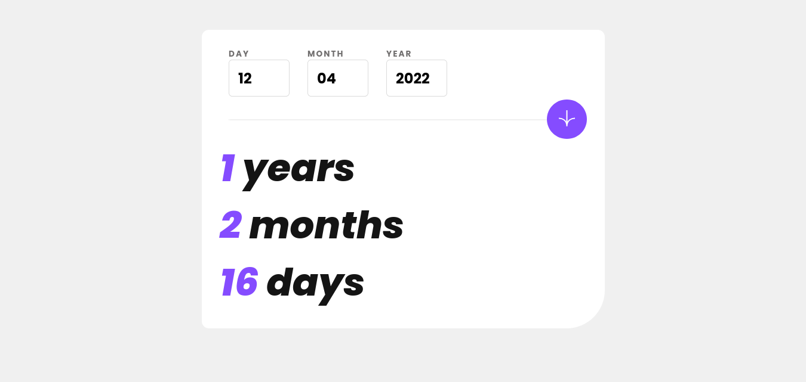

# Frontend Mentor - Age calculator app solution

This is a solution to the [Age calculator app challenge on Frontend Mentor](https://www.frontendmentor.io/challenges/age-calculator-app-dF9DFFpj-Q). Frontend Mentor challenges help you improve your coding skills by building realistic projects.

## Table of contents

- [Overview](#overview)
  - [The challenge](#the-challenge)
  - [Screenshot](#screenshot)
  - [Links](#links)
- [My process](#my-process)
  - [Built with](#built-with)
  - [What I learned](#what-i-learned)
  - [Continued development](#continued-development)
  - [Useful resources](#useful-resources)
- [Author](#author)

**Note: Delete this note and update the table of contents based on what sections you keep.**

## Overview

### The challenge

Users should be able to:

- View an age in years, months, and days after submitting a valid date through the form
- Receive validation errors if:
  - Any field is empty when the form is submitted
  - The day number is not between 1-31
  - The month number is not between 1-12
  - The year is in the future
  - The date is invalid e.g. 31/04/1991 (there are 30 days in April)
- View the optimal layout for the interface depending on their device's screen size
- See hover and focus states for all interactive elements on the page
- **Bonus**: See the age numbers animate to their final number when the form is submitted

### Screenshot




### Links

- Solution URL: [Add solution URL here](https://github.com/Nasadmi/AgeCalculatorMainChallenge)
- Live Site URL: [Add live site URL here](https://stunning-begonia-caab31.netlify.app/)

## My process

- Create HTML and Styles for mobile
- Adapt styles to computer
- Create consts of JavaScript
- Create Errors Logic
- Create Erros Styles
- Create the logic
- Create Number Animation

### Built with

- Semantic HTML5 markup
- CSS custom properties
- Flexbox
- Mobile-first workflow
- Javascript Vanilla

### What I learned

```html
<h1>Anything new</h1>
```

```css
/* Anything new */
```

```js
// Use the Date class and better use the Math class
const date = new Date();

const currentDay = date.getDate();

const currentMonth = date.getMonth() + 1;

const currentYear = date.getFullYear();

// Math

let arr_year = [];
for (let i = 0; i < 10; i++) {
  arr_year.push(Math.floor(Math.random() * (100 - 0 + 1) + 0));
  if (i > 8) {
    continue;
  }
}
Elements.span_year.innerHTML = `${
  arr_year[Math.floor(Math.random() * arr_year.length)]
}`;

// And know how to use intervals and set time out
setTimeout(() => {
  clearInterval(intervals);
  intervals = null;
  Calculate({ year: data_year, month: data_month, day: data_day });
}, 1000);
```

### Continued development

- Learning more about Math and Date classes
- Learning more about setInterval and setTimeOut

### Useful resources

- [Example resource 1](https://developer.mozilla.org/es/) - Functions About Math and Date classes

## Author

- Website - [Add your name here](https://github.com/Nasadmi)
- Frontend Mentor - [@Nasadmi](https://www.frontendmentor.io/profile/Nasadmi)
